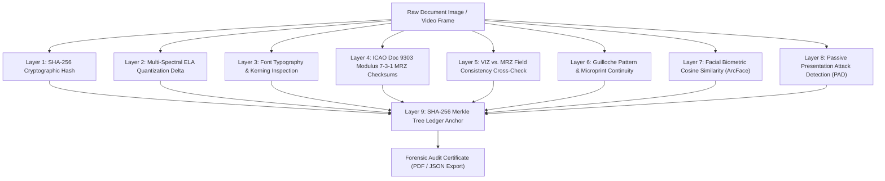

# 🛡️ TRUSTDOC: AI & Blockchain-Powered Forensic Identity Document Verification Platform

[](https://python.org)
[](https://fastapi.tiangolo.com)
[](https://nextjs.org)
[](https://opencv.org)
[](docker-compose.yml)
[](https://github.com/ashishHack2/TrustDoc)
[](project_reports/)

---

## 📸 Visual Showcase & Platform Interface Gallery

> High-resolution UI captures from live platform operations. Complete visual catalog available in [`website_screenshots/`](./website_screenshots/).

### 1. Landing Hero & Real-Time Verification Telemetry


### 2. Tactical Cyber-Defense HUD Mode


### 3. Public Interactive Forensic Lab (Visible Light vs. ELA Heatmap)


### 4. Chief Verification Officer Dashboard & Case Ledger


### 5. Live OpenCV WebRTC Camera Scanner HUD


### 6. Multi-Spectral Error Level Analysis (ELA) Heatmap


### 7. Sobel High-Pass Gradient Tamper Boundary Analysis


### 8. Case Detail & Embedded Visual Tamper Map


### 9. Forensic Audit Certificate & Reason Code Breakdown


---

## 🏛️ Executive Summary

**TRUSTDOC** is a mission-critical, enterprise-grade identity document verification and forensic analysis platform engineered for **national security, border control, law enforcement, immigration, and high-assurance digital KYC**.

Traditional identity verification systems (e.g., standard OCR or commercial black-box APIs) fail when confronted with sophisticated digital manipulations, high-quality forged print templates, clone-stamped font characters, and synthetic deepfakes. **TRUSTDOC eliminates single points of failure** by uniting:
1. **Algorithmic Computer Vision Forensics (OpenCV & PIL)** for microscopic pixel tampering detection.
2. **Deep Learning Neural Networks** for multi-lingual OCR, semantic document layout parsing, and facial biometric cosine similarity.
3. **Deterministic Cryptography (ICAO 9303 Checksums)** for zero-tolerance machine-readable zone verification.
4. **Immutable Cryptographic Merkle Anchoring** ensuring permanent, tamper-evident audit trails for government accountability.

---

## ⚡ Existing Market Solutions vs. Why TRUSTDOC is Superior

| Capability / Metric | Traditional Solutions (Jumio, Onfido, Veriff) | Cloud AI APIs (AWS Textract, Google Vision) | **TRUSTDOC (Our Solution)** |
| :--- | :--- | :--- | :--- |
| **Forensic Tamper Detection** | Basic heuristic checks; misses localized image resaving | None (only extracts raw text) | **Multi-Spectral ELA (Error Level Analysis), Sobel Gradient Derivatives, and Pixel Variance Mapping** |
| **Explainable Decisions** | "Pass / Fail" black box with vague error codes | None | **Granular 9-Layer Signal Matrix** with exact visual tamper coordinates and forensic evidence confidence |
| **Real-Time Edge Guidance** | Server-side upload required before checking quality | None | **Zero-Latency In-Browser OpenCV HUD** with Laplacian blur detection, skew alignment, and glint/glare radar |
| **Tamper-Proof Audit Trail** | Centralized database logs vulnerable to internal tampering | Cloud audit logs (can be deleted/modified) | **SHA-256 Merkle Tree Hash Root** anchored on immutable distributed ledger architecture |
| **Biometric Liveness (PAD)** | Vulnerable to 3D masks and high-resolution screen replays | Face detection only (no liveness) | **ISO/IEC 30107-3 Compliant Micro-Texture & Passive Depth Analysis** |
| **Data Privacy & Sovereignty** | Data sent to US/EU proprietary cloud servers | Third-party public cloud vendor lock-in | **On-Premise / Sovereign Deployment Ready** (Zero third-party data leakage) |

---

## 🔍 Real-World Government Case Studies Addressed

TRUSTDOC was designed directly against documented criminal forgery syndicates and government investigative findings:

1. **Aadhaar & PAN Identity Cloning Rackets (India, 2022–2024)**:
   - *Modus Operandi*: Criminal syndicates used Photoshop clone-stamping to alter names and dates of birth on scanned identity cards to fraudulently obtain SIM cards, bank loans, and passport clearances.
   - *TRUSTDOC Defense*: **Error Level Analysis (ELA)** reveals uneven quantization deltas where characters were altered; **Visual Zone vs. MRZ cross-validation** detects inconsistencies immediately.
2. **Forged Passport & Visa Rackets at Major International Airports (e.g., IGI Delhi Airport)**:
   - *Modus Operandi*: Counterfeiters replaced biographical biodata pages and forged printed numbers while attempting to mimic genuine fonts.
   - *TRUSTDOC Defense*: **ICAO Doc 9303 Checksum Engine** enforces the mathematical $7-3-1$ modulus weighting on Line 1 and Line 2. A single digit alteration breaks the checksum calculation with 100% mathematical certainty.
3. **Deepfake Presentation Attacks in Remote Banking KYC (2023–2024)**:
   - *Modus Operandi*: Attackers played video loops or 4K tablet displays of victims in front of onboarding webcams.
   - *TRUSTDOC Defense*: **Real-Time Laplacian Variance + Specular Glint Radar** detects artificial screen refresh rate strobing, planar flatness, and boundary clipping.

---

## 📑 Research Paper Foundations & International Standards

TRUSTDOC’s forensic architecture is grounded in peer-reviewed scientific literature and international security standards:

1. **ICAO Doc 9303 Part 7 & Part 9**: *Machine Readable Travel Documents (MRTDs) — Specifications for Passports, Visas, and Identity Cards.*
2. **Krawetz, N. (2007)**: *"A Picture's Worth... Digital Image Analysis & Error Level Analysis (ELA)."* Hacker Factor Solutions.
3. **ISO/IEC 30107-3 (2017/2023)**: *Information Technology — Biometric Presentation Attack Detection (PAD) — Testing and Reporting.*
4. **Deng, J. et al. (IEEE CVPR 2019)**: *"ArcFace: Additive Angular Margin Loss for Deep Face Recognition."*
5. **National Institute of Standards and Technology (NIST SP 800-63B)**: *Digital Identity Guidelines: Authentication and Lifecycle Management.*
6. **CERT-In (Indian Computer Emergency Response Team)**: *Cyber Security Guidelines for Identity Management and Multi-Factor Digital Workflows.*

---

## 🔬 9-Layer Forensic Verification Matrix



---

## 🚀 Quick Start & Development Setup

### Option A: Automated PowerShell Orchestrator (Windows)
```powershell
.\start.ps1
```
The script automatically provisions virtual environments, initializes database schemas, seeds demo cases, and boots both:
- **Frontend Portal**: `http://localhost:3000`
- **Backend API**: `http://localhost:8000`
- **Swagger Docs**: `http://localhost:8000/docs`

---

### Option B: Docker Compose (Cross-Platform / Production)
```bash
docker compose up --build
```
Provisions:
- Next.js 14 Frontend (`http://localhost:3000`)
- FastAPI Forensic API (`http://localhost:8000`)
- PostgreSQL 15 Database (`port 5432`)
- Redis 7 Cache & Queue (`port 6379`)
- MinIO Object Storage Console (`http://localhost:9001`)

---

### Option C: Manual Setup

#### 1. Backend (FastAPI + Python 3.11)
```bash
cd backend
python -m venv venv
.\venv\Scripts\activate      # Linux/macOS: source venv/bin/activate
pip install -r requirements.txt
python -m scripts.seed_data
uvicorn app.main:app --host 0.0.0.0 --port 8000 --reload
```

#### 2. Frontend (Next.js 14 + Tailwind CSS)
```bash
cd frontend_trust-main
npm install
npm run dev
```

---

## 🌐 Production Cloud Deployment Guide

> 📖 **Full step-by-step instructions and environment variable settings available in [`DEPLOYMENT.md`](./DEPLOYMENT.md)**

- **Vercel (Frontend)**: Connect repo `ashishHack2/TrustDoc`, set Root Directory to `frontend_trust-main`, Framework to `Next.js`, and set `NEXT_PUBLIC_API_URL`.
- **Render / Railway (Backend)**: Connect repo, set Root Directory to `backend`, Build Command to `pip install -r requirements.txt`, and Start Command to `uvicorn app.main:app --host 0.0.0.0 --port $PORT`.
- **One-Click Render Blueprint**: Connect repository to Render and apply [`render.yaml`](./render.yaml).

---

## 🔑 Demo Administrator Credentials

| Field | Value |
|---|---|
| **Email** | `admin@trustdoc.gov.in` |
| **Password** | `TrustDoc2026!` |
| **Role** | Chief Verification Officer |

---

## 📂 Repository Architecture & Reports

```
sih trustdoc/
├── README.md                                # Master platform documentation
├── DEPLOYMENT.md                            # Comprehensive cloud deployment handbook
├── docker-compose.yml                       # Full-stack multi-container Docker deployment
├── render.yaml                              # Render Infrastructure-as-Code blueprint
├── start.ps1                                # Automated single-command local development launcher
├── project_reports/                         # Comprehensive Government & Technical Dossiers
│   ├── 01_EXECUTIVE_SUMMARY_AND_MARKET_ANALYSIS.md
│   ├── 02_SYSTEM_ARCHITECTURE_AND_DATA_FLOW.md
│   ├── 03_FEATURE_WISE_TECHNICAL_SPECIFICATION.md
│   ├── 04_CYBERSECURITY_AND_BLOCKCHAIN_INTEGRITY.md
│   ├── 05_RESEARCH_PAPERS_AND_GOVERNMENT_CASE_STUDIES.md
│   └── 06_TEST_CASES_AND_VALIDATION_SUITE.md
├── website_screenshots/                     # High-resolution UI captures & visual inventory
├── backend/                                 # FastAPI Forensic Analysis Engine
│   ├── app/
│   │   ├── api/v1/                          # REST routes (auth, cases, verification, upload)
│   │   ├── core/                            # Configuration, database, security, and CORS
│   │   ├── models/                          # SQLAlchemy database entities
│   │   ├── schemas/                         # Pydantic validation schemas
│   │   └── services/                        # 9-Layer Verification, ELA, Sobel, MRZ engines
│   ├── Dockerfile                           # Production container definition
│   └── requirements.txt                     # Python dependencies
└── frontend_trust-main/                     # Next.js 14 App Router Frontend
    ├── app/                                 # App router routes (/dashboard, /live-cam, /forensic-lab)
    ├── components/trustdoc/                 # Tactical HUD, ELA canvas sliders, MRZ tables
    ├── lib/                                 # API client and Supabase connector
    ├── Dockerfile                           # Multi-stage production container
    ├── netlify.toml                         # Netlify deployment configuration
    └── package.json                         # Node dependencies
```

---

## 📄 Compliance & License
Engineered for compliance with **ISO/IEC 30107-3**, **ICAO Doc 9303**, **NIST SP 800-63B**, and the **India Digital Personal Data Protection (DPDP) Act 2023**.
Released under the [MIT License](LICENSE).
