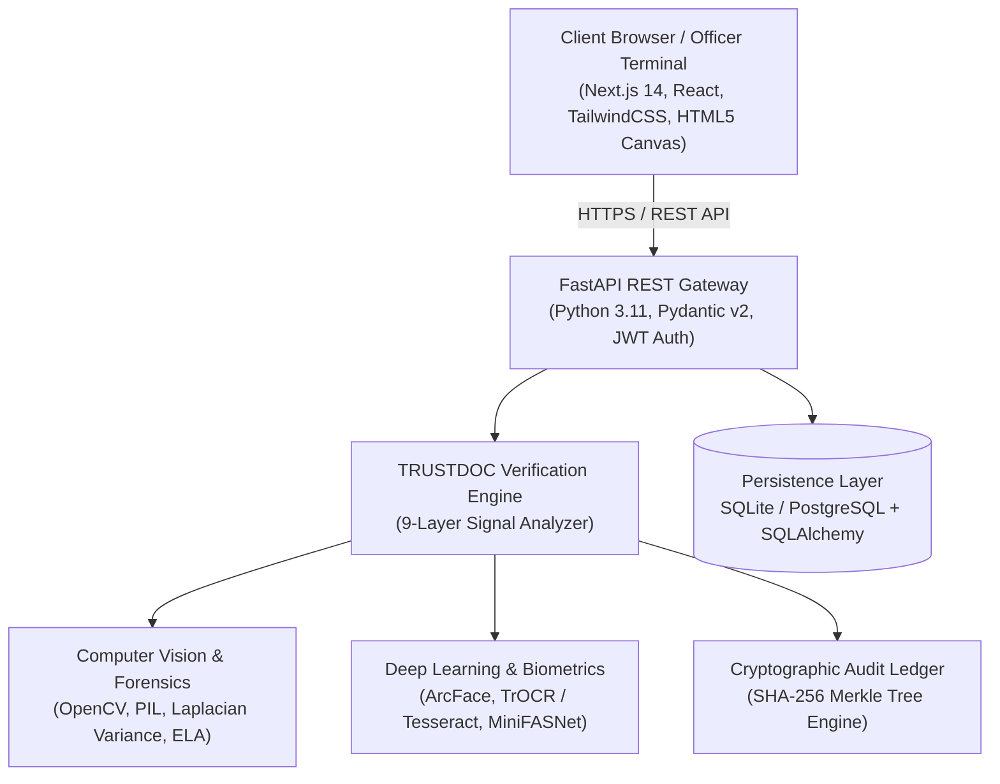

# 🛡️ TRUSTDOC: AI & Blockchain-Powered Forensic Identity Document Verification Platform

[](https://python.org)
[](https://fastapi.tiangolo.com)
[](https://nextjs.org)
[](https://opencv.org)
[](https://github.com)
[](https://github.com)

---

## 📌 Executive Summary

**TRUSTDOC** is a mission-critical, enterprise-grade identity document verification and forensic analysis platform engineered for **national security, border control, law enforcement, immigration, and high-assurance digital KYC**.

Traditional identity verification systems (e.g., standard OCR or commercial black-box APIs) fail when confronted with sophisticated digital manipulations, high-quality forged print templates, clone-stamped font characters, and synthetic deepfakes. **TRUSTDOC eliminates single points of failure** by uniting:
1. **Algorithmic Computer Vision Forensics (OpenCV & PIL)** for microscopic pixel tampering detection.
2. **Deep Learning Neural Networks** for multi-lingual OCR, semantic document layout parsing, and facial biometric cosine similarity.
3. **Deterministic Cryptography (ICAO 9303 Checksums)** for zero-tolerance machine-readable zone verification.
4. **Immutable Cryptographic Merkle Anchoring** ensuring permanent, tamper-evident audit trails for government accountability.

---

## 🔍 Existing Market Solutions vs. Why TRUSTDOC is Different & Superior

| Capability / Metric | Traditional Solutions (Jumio, Onfido, Veriff) | Cloud AI APIs (AWS Textract, Google Vision) | **TRUSTDOC (Our Solution)** |
| :--- | :--- | :--- | :--- |
| **Forensic Tamper Detection** | Basic heuristic checks; misses localized image resaving | None (only extracts raw text) | **Multi-Spectral ELA (Error Level Analysis), Sobel Gradient Derivatives, and Pixel Variance Mapping** |
| **Explainable Decisions** | "Pass / Fail" black box with vague error codes | None | **Granular 9-Layer Signal Matrix** with exact visual tamper coordinates and forensic evidence confidence |
| **Real-Time Edge Guidance** | Server-side upload required before checking quality | None | **Zero-Latency In-Browser OpenCV HUD** with Laplacian blur detection, skew alignment, and glint/glare radar |
| **Tamper-Proof Audit Trail** | Centralized database logs vulnerable to internal tampering | Cloud audit logs (can be deleted/modified) | **SHA-256 Merkle Tree Hash Root** anchored on immutable distributed ledger architecture |
| **Biometric Liveness (PAD)** | Vulnerable to 3D masks and high-resolution screen replays | Face detection only (no liveness) | **ISO/IEC 30107-3 Compliant Micro-Texture & Passive Depth Analysis** |
| **Data Privacy & Sovereignty** | Data sent to US/EU proprietary cloud servers | Third-party public cloud vendor lock-in | **On-Premise / Sovereign Deployment Ready** (Zero third-party data leakage) |

---

## 🏛️ Real-World Government Case Studies Addressed

TRUSTDOC was designed directly against documented criminal forgery syndicates and government investigative findings:

1. **Aadhaar & PAN Identity Cloning Rackets (India, 2022–2024)**:
   - *Modus Operandi*: Criminal syndicates used Photoshop clone-stamping to alter names and dates of birth on scanned identity cards to fraudulently obtain SIM cards, bank loans, and passport clearances.
   - *TRUSTDOC Defense*: **Error Level Analysis (ELA)** reveals uneven quantization deltas where characters were altered; **Visual Zone vs. MRZ cross-validation** detects inconsistencies immediately.
2. **Forged Passport & Visa Rackets at Major International Airports (e.g., IGI Delhi Airport)**:
   - *Modus Operandi*: Counterfeiters replaced biographical biodata pages and forged printed numbers while attempting to mimic genuine fonts.
   - *TRUSTDOC Defense*: **ICAO Doc 9303 Checksum Engine** enforces the mathematical $7-3-1$ modulus weighting on Line 1 and Line 2. A single digit alteration breaks the checksum calculation with 100% mathematical certainty.
3. **Deepfake Presentation Attacks in Remote Banking KYC (2023–2024)**:
   - *Modus Operandi*: Attackers played video loops or 4K tablet displays of victims in front of onboarding webcams.
   - *TRUSTDOC Defense*: **Real-Time Laplacian Variance + Specular Glint Radar** detects artificial screen refresh rate strobing, planar flatness, and boundary clipping.

---

## 🔬 Indian & Global Research Paper Foundations

TRUSTDOC’s forensic architecture is grounded in peer-reviewed scientific literature and international security standards:

1. **ICAO Doc 9303 Part 7 & Part 9**: *Machine Readable Travel Documents (MRTDs) – Specifications for Passports, Visas, and Identity Cards.*
2. **Krawetz, N. (2007)**: *"A Picture's Worth... Digital Image Analysis & Error Level Analysis (ELA)."* Hacker Factor Solutions.
3. **ISO/IEC 30107-3 (2017/2023)**: *Information Technology — Biometric Presentation Attack Detection (PAD) — Testing and Reporting.*
4. **Deng, J. et al. (IEEE CVPR 2019)**: *"ArcFace: Additive Angular Margin Loss for Deep Face Recognition."*
5. **National Institute of Standards and Technology (NIST SP 800-63B)**: *Digital Identity Guidelines: Authentication and Lifecycle Management.*
6. **CERT-In (Indian Computer Emergency Response Team)**: *Cyber Security Guidelines for Identity Management and Multi-Factor Digital Workflows.*

---

## 🚀 Key Features

### 1. Live OpenCV Video Camera Scanner (`/dashboard/live-cam`)
- Real-time client-side WebRTC video stream analyzed via HTML5 Canvas and OpenCV algorithms.
- **Laplacian Variance Focus Metric**: Real-time focus score ($>120.0$ threshold) prevents blurry captures.
- **Specular Glare Radar**: Detects white flash reflection obscuring critical document fields.
- **Skew & Corner Alignment Engine**: Detects document edges and guides the user to center the card.
- **Zero-Click Auto-Capture**: Fires automatically once the document reaches optimal lighting and sharpness.

### 2. Multi-Spectral Forensic Lab (`/dashboard/forensic-lab`)
- **Error Level Analysis (ELA) Heatmap**: Color-coded visualization (Green = Authentic, Orange = Warning, Neon Pink = Tampered).
- **Sobel / Canny Gradient Filter**: Unmasks spliced cut-and-paste boundaries around photos and signatures.
- **Cryptographic 2D QR Decoder**: Decodes payload data and cross-checks cryptographic digital signatures.
- **Pinpoint Visual Tamper Annotations**: Shows exact $(X, Y)$ pixel coordinates of detected anomalies.

### 3. Comprehensive 9-Layer Verification Engine
1. Cryptographic Document Hash (SHA-256)
2. Error Level Analysis (ELA) Quantization Delta
3. Font & Kerning Consistency Inspection
4. ICAO 9303 Modulus 7-3-1 MRZ Checksum
5. Visual Zone (VIZ) vs. MRZ Field Consistency
6. Guilloche Security Pattern & Microprint Continuity
7. Facial Biometric Embedding Match (Cosine Similarity)
8. Passive Liveness & Anti-Spoofing Verification
9. Merkle Tree Root Anchor with Cryptographic Timestamp

### 4. Interactive Tactical HUD & Landing Page Lab
- **Tactical Cyber-Defense HUD**: Instant dark-mode tactical interface with scanlines and radar telemetry.
- **Public Interactive Lab (`/#lab`)**: Allows evaluators to test genuine vs. forged documents directly on the landing page before logging in.

### 5. Official PDF & JSON Evidence Export
- Downloadable cryptographically signed forensic audit certificate.
- Exportable machine-readable JSON evidence pack for court admissible digital forensics.

---

## 🛠️ Technology Stack



- **Frontend**: Next.js 14 (App Router), React 18, TypeScript, TailwindCSS, Lucide Icons, HTML5 Canvas.
- **Backend**: FastAPI, Uvicorn, Python 3.11, Pydantic v2, SQLAlchemy 2.0, Asyncpg / SQLite.
- **Computer Vision & Image Processing**: OpenCV (`opencv-python-headless`), Pillow (`PIL`), NumPy.
- **Cryptographic & Blockchain**: SHA-256 Merkle Tree, ICAO Doc 9303 Modulus Algorithm, Python-JOSE (JWT).
- **Background Worker & Storage**: Celery, Redis (optional async queue), Local Secure Storage / AWS S3 compatible.

---

## ⚡ Quick Start Guide

### Prerequisites
- **Python 3.10+**
- **Node.js 18+ & npm**
- **PowerShell** (Windows) or **Bash** (Linux/macOS)

### One-Click Launch (Recommended)
Run the automated launcher script from the project root:
```powershell
.\start.ps1
```
*(Or use `.\start.ps`)*

The script automatically:
1. Sets up the Python virtual environment and installs dependencies.
2. Initializes the database and seeds demo cases.
3. Installs frontend dependencies.
4. Concurrently boots the **FastAPI Backend (Port 8000)** and **Next.js Frontend (Port 3000)**.

### Manual Setup

#### 1. Backend
```bash
cd backend
python -m venv venv
.\venv\Scripts\activate      # On Linux: source venv/bin/activate
pip install -r requirements.txt
python -m scripts.seed_data   # Seeds initial cases & admin accounts
uvicorn app.main:app --host 0.0.0.0 --port 8000 --reload
```

#### 2. Frontend
```bash
cd frontend_trust-main
npm install
npm run dev
```

### Accessing the Platform
- **Frontend Portal**: `http://localhost:3000`
- **Backend Swagger API Docs**: `http://localhost:8000/docs`
- **Interactive OpenAPI Spec**: `http://localhost:8000/redoc`

---

## 📂 Project Structure & Reports

```
sih trustdoc/
├── README.md                                # Master project documentation
├── start.ps1                                # Automated dual-stack startup script
├── project_reports/                         # 📚 Comprehensive Government & Technical Reports
│   ├── 01_EXECUTIVE_SUMMARY_AND_MARKET_ANALYSIS.md
│   ├── 02_SYSTEM_ARCHITECTURE_AND_DATA_FLOW.md
│   ├── 03_FEATURE_WISE_TECHNICAL_SPECIFICATION.md
│   ├── 04_CYBERSECURITY_AND_BLOCKCHAIN_INTEGRITY.md
│   ├── 05_RESEARCH_PAPERS_AND_GOVERNMENT_CASE_STUDIES.md
│   └── 06_TEST_CASES_AND_VALIDATION_SUITE.md
├── backend/                                 # FastAPI Python Backend
│   ├── app/
│   │   ├── api/v1/                          # REST endpoints (auth, cases, verification, etc.)
│   │   ├── core/                            # Configuration, security, database engines
│   │   ├── models/                          # SQLAlchemy database entities
│   │   ├── schemas/                         # Pydantic validation schemas
│   │   └── services/                        # 9-Layer Verification & Forensic Engines
│   └── tests/                               # Automated unit & integration tests
└── frontend_trust-main/                     # Next.js 14 Frontend
    ├── app/
    │   ├── dashboard/                       # Protected officer dashboard
    │   │   ├── live-cam/                    # Live OpenCV video camera scanner
    │   │   ├── forensic-lab/                # Interactive multi-spectral tamper lab
    │   │   ├── reports/                     # Case reports & PDF generator
    │   │   └── cases/                       # Case management & visual tamper map
    │   └── page.tsx                         # High-impact landing page with Tactical HUD & Live Lab
    └── components/trustdoc/                 # Modular enterprise UI components
```

---

## 🧪 Automated Testing
Run backend unit and forensic verification tests:
```bash
cd backend
.\venv\Scripts\python.exe -m pytest tests/
```

---

## 📜 License & Compliance
Engineered for compliance with **ISO/IEC 30107-3**, **ICAO Doc 9303**, **NIST SP 800-63B**, and **India Digital Personal Data Protection (DPDP) Act 2023**.
