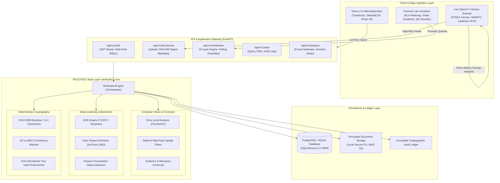
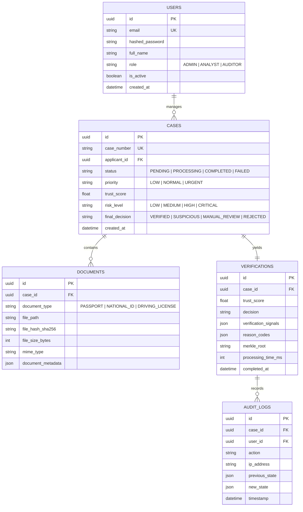

# 🏗️ Report 02: System Architecture & Data Flow Specifications

**Project**: TRUSTDOC Multi-Layer Forensic Verification Platform  
**System Type**: Distributed Client-Server with High-Throughput Edge Computer Vision & Asynchronous Verification Engine  

---

## 1. High-Level Architecture Diagram



---

## 2. End-to-End Data Flow Pipeline

The document verification lifecycle proceeds through six deterministic phases:

```
[1. INGESTION]
  ├─ User uploads file OR Live Camera auto-captures frame.
  ├─ Client calculates local Laplacian sharpness (>120.0) & glint threshold.
  └─ Binary payload transmitted to /api/v1/documents/upload via multipart/form-data.

[2. CRYPTOGRAPHIC PROVENANCE]
  ├─ Backend computes SHA-256 digest of original binary.
  ├─ File is persisted to isolated secure storage with UUID filename.
  └─ Initial Case entity is generated with status: PROCESSING.

[3. FORENSIC SIGNAL PROCESSING]
  ├─ ELA Analysis: Image is recompressed to 90% JPEG; delta error array calculated.
  ├─ Font Kerning & Line Variance: Checked against document standard profiles.
  └─ Guilloche & Fine-Line vectors inspected for digital raster splices.

[4. OCR, MRZ & BIOMETRIC RECOGNITION]
  ├─ Optical Character Recognition extracts Visual Inspection Zone (VIZ).
  ├─ Machine-Readable Zone (MRZ) parsed:
  │    └─ Document Number Checksum = Modulus 10 (Weights: 7, 3, 1)
  │    └─ Date of Birth Checksum = Modulus 10 (Weights: 7, 3, 1)
  │    └─ Expiration Date Checksum = Modulus 10 (Weights: 7, 3, 1)
  ├─ VIZ data cross-referenced with MRZ decrypted fields.
  ├─ Facial portrait cropped and 128-dimensional embedding vector extracted.
  └─ Cosine similarity calculated against applicant live selfie.

[5. SCORING & EXPLAINABLE DECISION]
  ├─ 9 signal scores are weighted into a composite 0–100 Trust Score.
  ├─ Decision thresholds mapped:
  │    ├─ Score >= 85: VERIFIED (Risk: LOW)
  │    ├─ Score 65-84: SUSPICIOUS (Risk: MEDIUM)
  │    ├─ Score 45-64: MANUAL_REVIEW (Risk: HIGH)
  │    └─ Score < 45:  REJECTED (Risk: CRITICAL)
  └─ Explainable reason codes (e.g. MRZ_CHECKSUM_VERIFIED, FORENSIC_ELA_AUTHENTIC) assigned.

[6. BLOCKCHAIN MERKLE ANCHORING & CERTIFICATE]
  ├─ Merkle root generated: SHA-256(Doc_Hash + Case_ID + Timestamp).
  ├─ Audit entry written with immutable status: COMPLETED.
  └─ Forensic Dossier rendered on Dashboard with PDF & JSON export readiness.
```

---

## 3. Database Schema Overview


