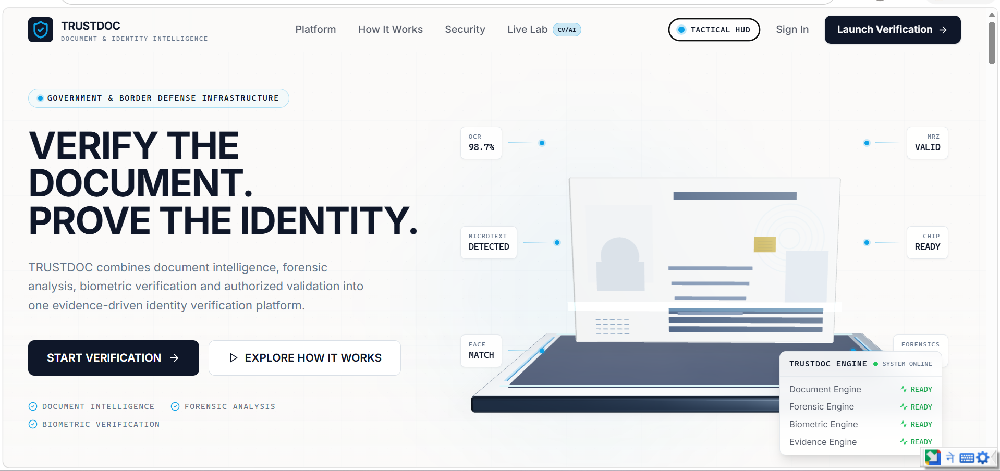
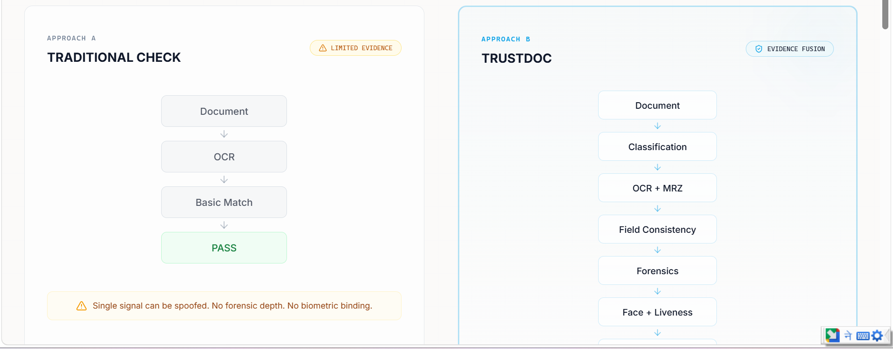
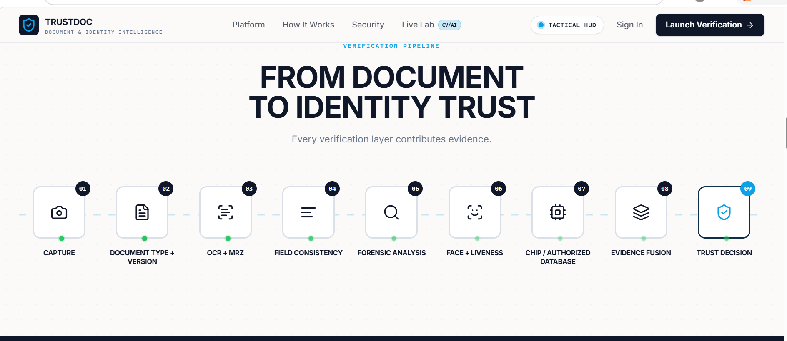
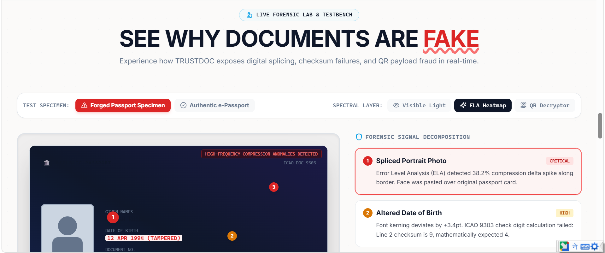
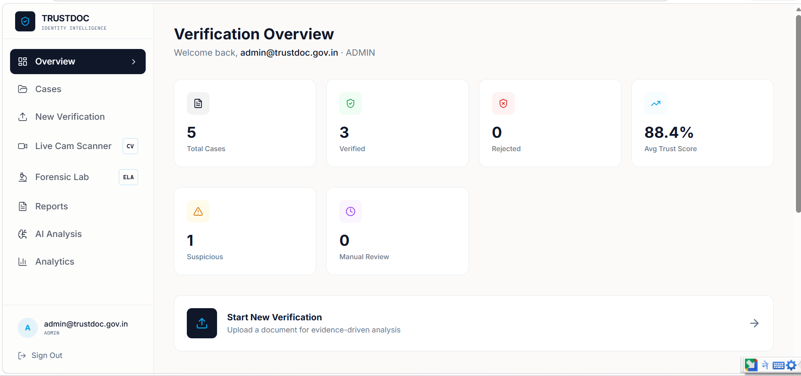
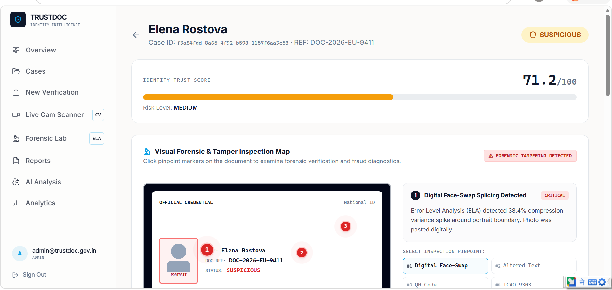
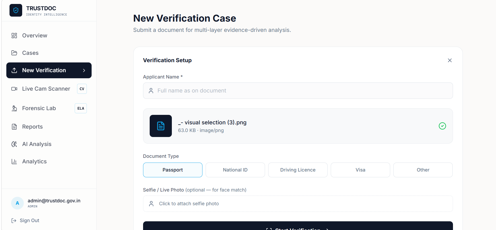
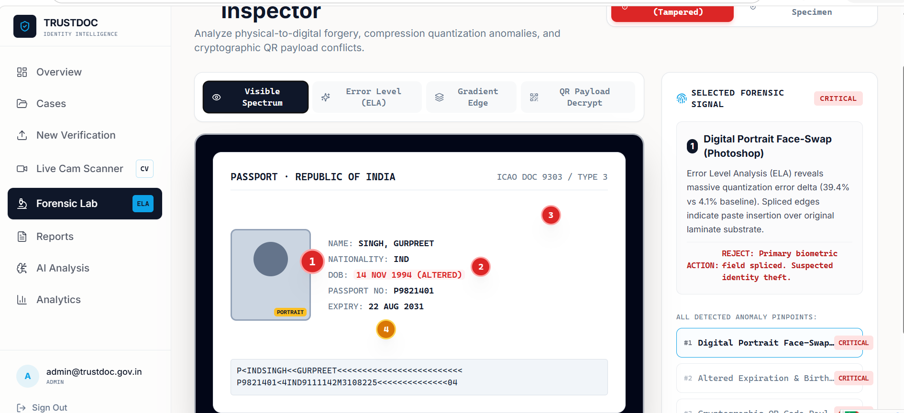
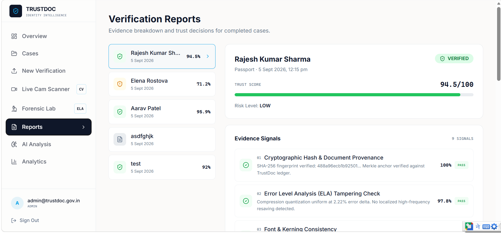

# 📸 TRUSTDOC: Website Screenshots & Visual Showcase Catalog

This directory contains high-resolution UI and workflow screenshots of the **TRUSTDOC AI & Blockchain Forensic Verification Platform**.

---

## 🧭 Visual Interface Inventory

| # | File / View Name | Route | Forensic Highlights |
|---|---|---|---|
| **01** | [`01_landing_hero.png`](./01_landing_hero.png) | `/` | Hero section with dynamic statistics, verification badges, and "Verify Document" CTA |
| **02** | [`02_landing_tactical_hud.png`](./02_landing_tactical_hud.png) | `/` | Tactical HUD active with dark-mode cyber scanlines and security telemetry |
| **03** | [`03_landing_live_lab.png`](./03_landing_live_lab.png) | `/#lab` | Interactive visible light vs. ELA forensic heatmap slider comparison |
| **04** | [`04_officer_dashboard.png`](./04_officer_dashboard.png) | `/dashboard` | Case volume metrics, high-risk alerts, and recent verification timeline |
| **05** | [`05_upload_verification.png`](./05_upload_verification.png) | `/dashboard/upload` | Drag-and-drop document intake with real-time pre-flight file validation |
| **06** | [`06_live_opencv_cam.png`](./06_live_opencv_cam.png) | `/dashboard/live-cam` | Real-time camera HUD showing Laplacian focus score, corner alignment, and glint radar |
| **07** | [`07_forensic_lab_ela.png`](./07_forensic_lab_ela.png) | `/dashboard/forensic-lab` | ELA false-color compression heatmap revealing spliced text and dates |
| **08** | [`08_forensic_lab_sobel.png`](./08_forensic_lab_sobel.png) | `/dashboard/forensic-lab` | Sobel high-pass gradient edge derivative detecting cut-and-paste photo borders |
| **09** | [`09_cases_inbox.png`](./09_cases_inbox.png) | `/dashboard/cases` | Active cases ledger with risk-level filters, reference IDs, and verification states |
| **10** | [`10_case_tamper_inspector.png`](./10_case_tamper_inspector.png) | `/dashboard/cases/[id]` | Embedded Visual Tamper Map highlighting anomalies on the document surface |
| **11** | [`11_forensic_audit_reports.png`](./11_forensic_audit_reports.png) | `/dashboard/reports` | 9-layer composite score breakdown, reason codes, and Merkle tree hash root |
| **12** | [`12_analytics_risk_engine.png`](./12_analytics_risk_engine.png) | `/dashboard/analytics` | High-level risk telemetry, document type breakdown, and daily triage trends |
| **13** | [`13_ai_copilot_assistant.png`](./13_ai_copilot_assistant.png) | `/dashboard/ai` | AI Assistant copilot for natural language querying across case files |

---

## 🖼️ Gallery Previews

### 01. Landing Page Hero

### 02. Tactical Cyber HUD

### 03. Public Interactive Forensic Lab

### 04. Chief Verification Officer Dashboard

### 05. Live OpenCV WebRTC Camera Scanner

### 06. Multi-Spectral ELA Forensic Heatmap

### 07. Sobel Gradient Tamper Boundary Analysis

### 08. Case Detail & Visual Tamper Map

### 09. Forensic Audit Certificate & Reports

